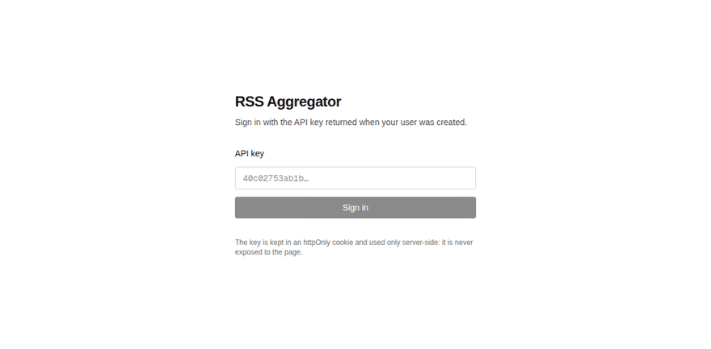

# 📡 RSS Aggregator with GO

[](https://golang.org/)
[](https://www.postgresql.org/)
[](https://redis.io/)
[](https://nextjs.org/)
[](https://react.dev/)
[](https://github.com/matteo-campana/rss-aggregator/actions/workflows/ci.yml)

The project is an RSS Aggregator built with Go, a statically typed, compiled programming language developed by Google. An RSS Aggregator is a type of software that fetches and consolidates RSS feeds from various sources into a single location. RSS, which stands for Really Simple Syndication, is a web feed that allows users and applications to access updates to websites in a standardized, computer-readable format.

This particular RSS Aggregator is designed to fetch data from various RSS feeds and aggregate it. The aggregated data is then stored in a Postgres database for later retrieval and analysis. Postgres, or PostgreSQL, is a powerful, open-source object-relational database system.

The requirements section lists the technologies needed to run the project: Go 1.24 and Postgres 16. Redis 7 is optional — see [Caching and rate limiting](#-caching-and-rate-limiting). The quickest way to get all of it running is the Docker stack below.

## 🎬 Demo

Sign in with an API key, then browse what the background scraper has already collected — filter by
title, category, source or seeders, and sort the results. Every filter lives in the URL, so a view
can be linked and shared. 🔗

<p align="center">
    
</p>

## 🧩 How it fits together

| Piece | Where | What it does |
| --- | --- | --- |
| 🌐 REST API | `backend/rss-aggregator` | Go + Gin + sqlc over Postgres |
| 🕷️ Scraper | `internal/scraper` | refreshes the feeds in the background, oldest first |
| 🔐 Auth | `internal/auth` | `Authorization: ApiKey <key>` on every non-public route |
| 🖥️ Frontend | `frontend/` | Next.js reader, server-side calls only |
| 🐘 Database | `sql/schema` | goose migrations, sqlc-generated queries |
| ⚡ Redis | `internal/cache` | optional: response cache, rate limiting, scraper locking |
| 🐳 Docker | `docker-compose.yml` | the whole stack, migrations included |

## 🚀 Getting Started

### 🐳 With Docker (everything at once)

```bash
cp .env.example .env        # adjust the Postgres credentials if needed
make docker-build
make docker-up              # API on :8080, frontend on :3000
make docker-logs
```

The stack brings up Postgres, Redis, a one-shot migration step and then the API and the
frontend. The API waits for a healthy database and for the migrations to finish before it
starts, so a first `up` on an empty volume works with no manual step.

### 🔧 Without Docker

```bash
cp .env.example .env
make docker-run             # just Postgres
make migrate-up             # apply the schema (requires goose)
make run                    # start the API on $PORT
make frontend-dev           # the reader on :3000
```

Run the checks with `make check` (gofmt, `go vet`, unit tests) and `make frontend-check`. ✅
The unit tests need neither a database nor network access. The integration suites do: they
run only when `TEST_DATABASE_URL` and `TEST_REDIS_ADDR` are set, and skip themselves
otherwise.

### 🔑 Authentication

Every route except `GET /api/v1/`, `GET /api/v1/health` and the registration
endpoint requires an API key:

```bash
curl -X POST localhost:8080/api/v1/users/ -d '{"fullname":"Matteo"}'   # returns api_key
curl -H "Authorization: ApiKey <api_key>" localhost:8080/api/v1/users/me
```

The key is generated by the database on registration and returned only by
`POST /api/v1/users/` and `GET /api/v1/users/me`, never by the user listing.

Feed follows belong to the caller and to nobody else: every `/feed-follows` route derives the
user from the API key, and a follow that belongs to somebody else answers `404`. The previous
`/feed-follows/user/:user_id` routes are gone — they let any valid key read and delete another
user's rows.

### 📚 Reading the aggregated items

```bash
curl -H "Authorization: ApiKey <api_key>" \
  "localhost:8080/api/v1/items/?sort=seeders&min_seeders=100&per_page=20"
```

`GET /items/` takes `search`, `category`, `min_seeders`, `channel_id`, `sort`
(`recent` · `seeders` · `oldest`) and pagination, and answers with the matching page plus the
total for those filters. `GET /items/categories` and `GET /channels/` back the filter menus.

`GET /feeds/` and `GET /users/` are paginated the same way, with `page` and `per_page`
(50 by default, 200 at most):

```json
{ "feeds": [], "page": 1, "per_page": 50, "total": 0 }
```

### 🐙 Fetching from Nyaa

```bash
curl -H "Authorization: ApiKey <api_key>" \
  "localhost:8080/api/v1/nyaa/rss?language=ITA&resolution=720p"
```

`language` accepts ENG, POR-BR, SPA-LA, SPA, ARA, FRE, GER, ITA and RUS; `resolution`
accepts 480p, 720p, 1080p and 4K. Both default to the previous behaviour (ENG, 1080p), and an
unknown value answers `400` listing what would have been accepted.

### ⚡ Caching and rate limiting

Redis is **optional**, and the API is built to work without it: with `REDIS_ENABLED=false`, or a
Redis that goes away while the API is running, the cache simply misses, the limiter allows every
request and the scraper lock is always granted. Errors are logged — throttled, so an outage does
not flood the log — and never returned to the caller.

When it is enabled:

- `GET /items/`, `/items/categories` and `/channels/` are cached for `CACHE_TTL` (60s by
  default) and report `X-Cache: hit|miss`. The scraper invalidates them as soon as it stores
  items, by bumping a version that is part of every cache key.
- each API key gets `RATE_LIMIT_REQUESTS` per `RATE_LIMIT_WINDOW` (120 per minute by default);
  over the limit the API answers `429` with `Retry-After`. Only the SHA-256 of the key is
  stored, never the key itself.
- the scraper takes a per-feed lock, so two instances never refresh the same feed at once.

### 🖥️ Frontend

The Next.js reader lives in `frontend/` and talks to the Go API server-side only:

```bash
cd frontend
npm install
cp .env.example .env.local     # point API_BASE_URL at the Go API
npm run dev                    # http://localhost:3000
```

Sign in with the API key returned by `POST /api/v1/users/`. The key is validated by a route
handler and stored in an httpOnly cookie, so it never reaches client-side JavaScript and the
browser only ever talks to the Next.js origin — which is also why the Go API needs no CORS
configuration. 🍪 The item list, its filters and the pagination all live in the URL, so a filtered
view can be linked and shared. A second page, `/feeds`, shows the configured feeds and when each
was last refreshed — read-only, since feed management still goes through the API.

### 🔄 Background scraper

With `SCRAPER_ENABLED=true` the API also refreshes the stored feeds on its own,
oldest first, every `SCRAPER_INTERVAL` (default `10m`) with `SCRAPER_CONCURRENCY`
feeds in flight (default `3`). Items are upserted on `(channel_id, guid)`, so re-fetching a
feed updates seeders and leechers instead of duplicating rows, and two feeds carrying the same
torrent each keep their own copy. ♻️

## 🗺️ Next Steps

This project starts to extend the tutorial / crash course [Golang Web Server and RSS Scraper | Full Tutorial](https://www.youtube.com/watch?v=dpXhDzgUSe4). My goal is to create a complete RSS aggregator to aggregate the rss feeds from [**fitgirl-repacks**](https://fitgirl-repacks.site/), [**DODI-repacks**](https://dodi-repacks.site/), and [**Nyaa**](https://nyaa.si/) and retrieve data from SteamDB and AnimeDB to get the latest game and anime releases and help users find the latest content without having to visit multiple websites. 🏴‍☠️

<p align="center">
    
</p>

## ✅ TODO

- [x] 🐹 Create a Go program to fetch RSS feeds
- [x] 🐘 Parse the fetched data and store it in a Postgres database
- [x] 🌐 Implement a REST API to retrieve the aggregated data
- [x] 🧪 Write tests to ensure the program works as expected
- [x] 🖥️ Define a front-end interface to display the aggregated data (Next.js reader in `frontend/`; feed management still to do)
- [x] 🔐 Add authentication and authorization to the REST API (API key; per-user authorization of feed-follows still open)
- [x] ⚡ Implement caching to improve performance (Redis, plus rate limiting and scraper locking)
- [ ] 🪵 Add error handling and logging to the program (optional)
- [ ] 🧹 Refactor the code to improve readability and maintainability (optional)
- [ ] 📝 Document the project to help other developers understand and contribute (optional)
- [ ] 📈 Optimize the program for scalability and efficiency (optional)
- [ ] 📰 Add support for additional RSS feed formats and sources (optional)
- [ ] 🔌 Integrate with third-party services for additional functionality (optional)
- [ ] 🤖 Implement a CI/CD pipeline to automate testing and deployment (testing done in `.github/workflows/ci.yml`, deployment still missing)
- [ ] 🚢 Deploy the project to a server for public access (images and compose stack ready, no target yet)
- [ ] 📊 Monitor the project for performance and stability (optional)
